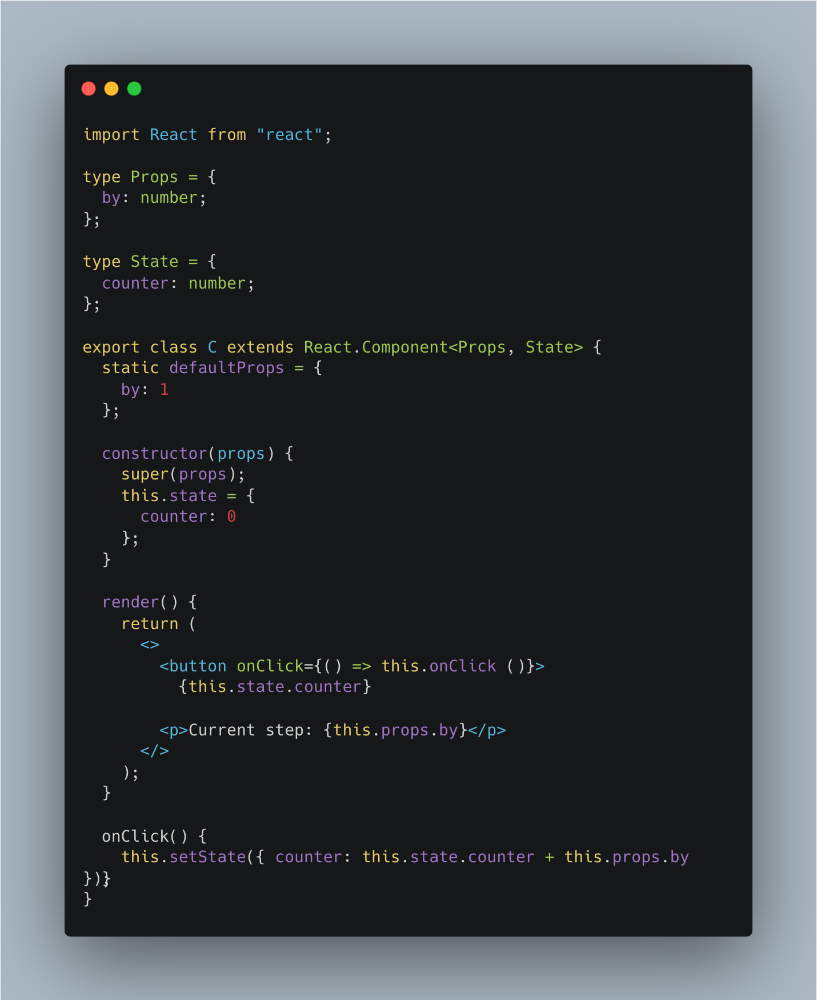
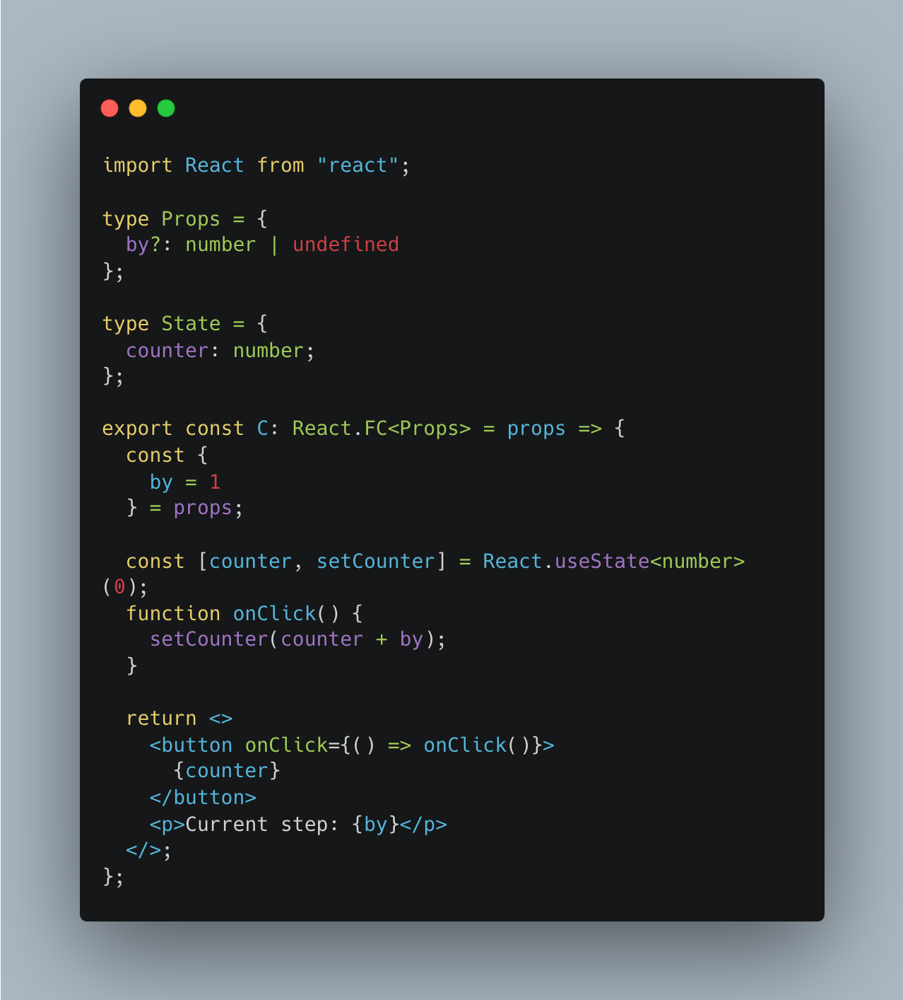

# react-declassify: say goodbye to class components

This codemod automatically transforms **React class components** into **React functional components using Hooks** for you!

|Before|After|
|---|---|
|||

## Features

- ✅ Supports props, states, methods, and refs.
- ✅ Comments, spaces, and styles are preserved thanks to the [recast](https://github.com/benjamn/recast) library.
- ✅ Designed to generate as idiomatic code as possible. Not something Babel or Webpack would generate!
- ✅ Based on classical heuristic automation; no need to be fearful about whimsy LLMs.

## Usage

```
yarn add -D @codemod/cli react-declassify
# OR
npm install -D @codemod/cli react-declassify
```

then

```
npx codemod --plugin react-declassify 'src/**/*.tsx'
```

## Example

Before:

```tsx
import React from "react";

type Props = {
  by: number;
};

type State = {
  counter: number;
};

export class C extends React.Component<Props, State> {
  static defaultProps = {
    by: 1
  };

  constructor(props) {
    super(props);
    this.state = {
      counter: 0
    };
  }

  render() {
    return (
      <>
        <button onClick={() => this.onClick()}>
          {this.state.counter}
        </button>
        <p>Current step: {this.props.by}</p>
      </>
    );
  }

  onClick() {
    this.setState({ counter: this.state.counter + this.props.by });
  }
}
```

After:

```tsx
import React from "react";

type Props = {
  by?: number | undefined
};

type State = {
  counter: number;
};

export const C: React.FC<Props> = props => {
  const {
    by = 1
  } = props;

  const [counter, setCounter] = React.useState<number>(0);

  function onClick() {
    setCounter(counter + by);
  }

  return <>
    <button onClick={() => onClick()}>
      {counter}
    </button>
    <p>Current step: {by}</p>
  </>;
};
```

Before:

```jsx
import React from "react";

export class C extends React.Component {
  render() {
    const { text, color } = this.props;
    return <button style={{ color }} onClick={() => this.onClick()}>{text}</button>;
  }

  onClick() {
    const { text, handleClick } = this.props;
    alert(`${text} was clicked!`);
    handleClick();
  }
}
```

After:

```jsx
import React from "react";

export const C = props => {
  const {
    text,
    color,
    handleClick
  } = props;

  function onClick() {
    alert(`${text} was clicked!`);
    handleClick();
  }

  return <button style={{ color }} onClick={() => onClick()}>{text}</button>;
};
```

## Progress

- [x] Convert render function (basic feature)
- [x] Superclass detection
  - [x] Support `React.Component`
  - [x] Support `React.PureComponent`
- [ ] Class node type
  - [x] Support class declarations
  - [x] Support `export default class` declarations
  - [ ] Support class expressions
- [ ] TypeScript support
  - [x] Add `React.FC` annotation
  - [x] Transform `P` type argument
  - [x] Transform `S` type argument
  - [x] Transform ref types
  - [ ] Transform generic components
  - [x] Modify Props appropriately if defaultProps is present
  - [ ] Modify Props appropriately if `children` seems to be used
- [ ] Support for `this.props`
  - [x] Convert `this.props` to `props` parameter
  - [ ] Rename `props` if necessary
  - [x] Hoist expansion of `this.props`
  - [x] Rename prop variables if necessary
  - [x] transform `defaultProps`
- [ ] Support for user-defined methods
  - [x] Transform methods to `function`s
  - [x] Transform class fields initialized as functions to `function`s
  - [ ] Use `useCallback` if deemed necessary
  - [ ] Auto-expand direct callback call (like `this.props.onClick()`) to indirect call
  - [x] Rename methods if necessary
  - [ ] Skip method-binding expressions (e.g. `onClick={this.onClick.bind(this)}`)
  - [ ] Skip method-binding statements (e.g. `this.onClick = this.onClick.bind(this)`)
- [ ] Support for `this.state`
  - [x] Decompose `this.state` into `useState` variables
  - [x] Rename states if necessary
  - [ ] Support updating multiple states at once
  - [ ] Support functional updates
  - [ ] Support lazy initialization
- [ ] Support for refs
  - [x] Transform `createRef` to `useRef`
  - [x] Transform member assignment to `useRef`
  - [ ] Transform legacy string refs as far as possible
- [ ] Support for lifecycles
  - [ ] Transform componentDidMount, componentDidUpdate, and componentWillUnmount
  - [ ]
- [ ] Support for receiving refs
  - [ ] Use `forwardRef` + `useImperativeHandle` when requested by the user
- [ ] Support for contexts
  - [ ] Transform `contextType` to `useContext`
  - [ ] Transform the second parameter for the legacy `contextTypes`
- [ ] Transform `static propTypes` to assignments
- [x] Rename local variables in `render` if necessary

## Known limitations

### Class refs

#### Symptom

You get the following type error:

```
test.tsx:1:1 - error TS2322: Type '{ ... }' is not assignable to type 'IntrinsicAttributes & Props'.
  Property 'ref' does not exist on type 'IntrinsicAttributes & Props'.

1 ref={ref}
  ~~~
```

or you receive the following warning in the console:

```
Warning: Function components cannot be given refs. Attempts to access this ref will fail. Did you mean to use React.forwardRef()?

Check the render method of `C`.
    at App
```

or you receive some sort of null error (e.g. `Cannot read properties of undefined (reading 'a')`) because `ref.current` is always undefined.

Type errors can also occur at `useRef` in a component that uses the component under transformation:

```
test.tsx:1:1 - error TS2749: 'C' refers to a value, but is being used as a type here. Did you mean 'typeof C'?

41 const component = React.useRef<C | null>(null);
                                  ~
```

#### Cause

Class components receives refs, and the ref points to the instance of the class. Functional components do not receive refs by default.

#### Solution

This is not implemented now. However, once it is implemented you can opt in ref support by certain directives. It will generate `forwardRef` + `useImperativeHandle` to expose necessary APIs.

### Stricter render types

### Symptom

You get the following type error:

```
test.tsx:1:1 - error TS2322: Type '(props: Props) => ReactNode' is not assignable to type 'FC<Props>'.
  Type 'ReactNode' is not assignable to type 'ReactElement<any, any> | null'.

1 const C: React.FC<Props> = (props) => {
        ~
```

### Cause

In DefinitelyTyped, `React.FC` is typed slightly stricter than the `render` method. You are expected a single element or `null`.

We leave this untransformed because it is known not to cause problems at runtime.

### Solution

An extra layer of a frament `<> ... </>` suffices to fix the type error.

## Assumptions

- It assumes that the component only needs to reference the latest values of `this.props` or `this.state`. This assumption is necessary because there is a difference between class components and funtion components in how the callbacks capture props or states. To transform the code in an idiomatic way, this assumption is necessary.
- It assumes, by default, the component is always instantiated without refs.
- It assumes that the methods always receive the same `this` value as the one when the method is referenced.
- It assumes that the component does not update the state conditionally by supplying `undefined` to `this.setState`. We need to replace various functionalities associated with `this` with alternative tools and the transformation relies on the fact that the value of `this` is stable all across the class lifecycle.
